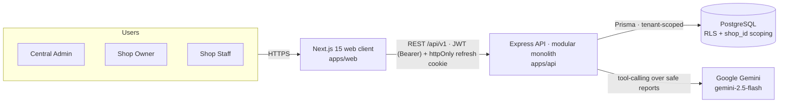

<div align="center">

# 💊 Stock Easy

**A FEFO-driven, multi-tenant pharmacy inventory & billing platform — with analytics and a GenAI assistant.**

[](./.github/workflows/ci.yml)
&nbsp;Next.js&nbsp;15 · React&nbsp;19 · Express · TypeScript · PostgreSQL · Prisma

</div>

> Stock Easy is a B2B SaaS for independent pharmacies and chains. Its core differentiator is
> **FEFO (First-Expiry-First-Out)** selling: every sale automatically consumes the batch closest to
> expiry first, so stock moves before it becomes waste. It adds an analytics command-center and a
> safe natural-language assistant on top.

---

## ✨ Highlights

| | |
|---|---|
| 🔁 **FEFO billing** | Each POS sale decrements stock from the nearest-expiry batch first, transactionally (advisory lock + `SELECT … FOR UPDATE`), with returns/voids restoring exact batches via a stock-movement ledger. |
| 🏢 **Multi-tenant** | Every pharmacy is a tenant (`shops` row). `shop_id` scopes every query; PostgreSQL **Row-Level Security** is available as defense-in-depth. Client-supplied `shop_id` is never trusted. |
| 🔐 **RBAC** | Three roles — `central_admin` (license verification + platform oversight), `shop_owner`, `shop_staff` — enforced from the JWT through middleware. |
| 📊 **Analytics** | Revenue, top medicines, expiring-soon, dead-stock, low-stock, inventory valuation — an executive dashboard + a dedicated analytics view. |
| 🤖 **GenAI assistant** | Natural-language questions answered via **tool-calling over a fixed set of safe, read-only analytics reports** — never raw LLM SQL. |
| 💳 **Subscriptions** | Plan tiers + entitlement model with an admin plan manager. |
| 💰 **Money contract** | All money is `Decimal`, ROUND_HALF_UP @2dp, GST tax-exclusive, serialized as 2dp strings — never floats. |
| ♿ **Production-grade UI** | Responsive (sidebar ⇄ drawer + bottom tab bar), table↔card transforms, designed loading/empty/error states, WCAG-AA-minded. Lighthouse (prod `/login`): **Perf 94 · A11y 95 · Best-Practices 96 · SEO 100**. |

📸 **Screenshots:** see [`docs/screenshots/`](docs/screenshots/) · 🎨 **Design system:** [`apps/web/DESIGN_SYSTEM.md`](apps/web/DESIGN_SYSTEM.md)

---

## 🏗️ Architecture at a glance



A **modular monolith** API (routes → controller → service → repository → Prisma; cross-cutting concerns
in middleware) talks to PostgreSQL. The web client is a Next.js App-Router SPA-style client that uses a
typed Axios layer + TanStack Query. Full as-built detail + diagrams: **[`docs/ARCHITECTURE.md`](docs/ARCHITECTURE.md)**.

---

## 📦 Repository layout

```
stock-easy/
├─ apps/
│  ├─ api/                 Express + TypeScript + Prisma (the backend)
│  │  ├─ src/              routes · controllers · services · repositories · middleware
│  │  ├─ prisma/           schema · migrations · seed/ · rls.sql
│  │  └─ tests/            Vitest integration tests (real PostgreSQL via Testcontainers)
│  └─ web/                 Next.js 15 + React 19 (the frontend)
│     ├─ src/app/          App Router route groups: (auth) · (app)
│     ├─ src/components/   ui/ (primitives) · shared/ · layout/
│     ├─ src/features/     dashboard · billing/pos · medicines · analytics · ai · admin · …
│     └─ DESIGN_SYSTEM.md  the "Slate Pro" design language
├─ .github/workflows/ci.yml
├─ docs/                   architecture · deployment · operations · environment · observability
├─ ARCHITECTURE.md         original design spec / roadmap
└─ PRODUCTION_READINESS.md security · performance · accessibility hardening report
```

> Tech: **Web** — Next.js 15, React 19, TanStack Query, Radix UI, Tailwind, Recharts, React-Hook-Form + Zod, Sonner.
> **API** — Express, Prisma 6, PostgreSQL, JWT + bcrypt, Helmet, express-rate-limit, Pino, Zod, `@google/genai`.

---

## 🚀 Quickstart (local)

**Prerequisites:** Node ≥ 20, PostgreSQL ≥ 14 (16+ recommended), npm.

```bash
# 1) API
cd apps/api
cp .env.example .env                 # then edit DATABASE_URL / secrets (see docs/ENVIRONMENT.md)
npm install
npm run prisma:generate
npm run db:migrate                   # apply migrations  (prisma migrate deploy)
npm run db:seed                      # rich demo dataset (8 shops, 304 meds, 550 batches, 930 bills)
npm run dev                          # → http://localhost:4000  (GET /health → 200)

# 2) Web (second terminal)
cd apps/web
cp .env.example .env.local           # NEXT_PUBLIC_API_URL defaults to http://localhost:4000/api/v1
npm install
npm run dev                          # → http://localhost:3000
```

### 🔑 Demo credentials (seeded)
All seeded accounts share the password **`StockEasy123!`**.

| Role | Email |
|---|---|
| Central admin | `admin@stockeasy.app` |
| Pharmacy owner | `owner.apollo@stockeasy.test` (8 shops: apollo, citymeds, greenleaf, healthfirst, janata, medplus, sunrise, wellness) |
| Pharmacy staff | `staff1.apollo@stockeasy.test` |

---

## 🧰 Common scripts

**`apps/api`** — `npm run dev` · `build` · `start` · `typecheck` · `prisma:generate` · `db:migrate` · `db:seed` · `db:reset` · `seed:verify` · `test` / `test:ci`
**`apps/web`** — `npm run dev` · `build` · `start` · `typecheck` · `lint`

---

## ✅ Quality & CI

Every PR + push to `main` runs [`.github/workflows/ci.yml`](.github/workflows/ci.yml):

- **Web** — typecheck · lint · production build · prod-dependency audit
- **API** — typecheck · build · prod-dependency audit
- **API tests** — Vitest integration suite on a real PostgreSQL 16 (Testcontainers), with coverage

Verified locally: both apps typecheck & build clean, **0 production-dependency vulnerabilities**, and the
API integration suite is green. Hardening details: **[`PRODUCTION_READINESS.md`](PRODUCTION_READINESS.md)**.

---

## 🌐 Deployment

Designed to deploy as three pieces — **Next.js web**, **Node/Express API**, **managed PostgreSQL** —
with no architecture changes. Step-by-step (Vercel + Render/Railway/Fly + Neon/Supabase/RDS), env setup,
migrations, rollback, and cross-site cookie configuration: **[`docs/DEPLOYMENT.md`](docs/DEPLOYMENT.md)**.

---

## 📚 Documentation

| Doc | What's inside |
|---|---|
| [`docs/ARCHITECTURE.md`](docs/ARCHITECTURE.md) | As-built architecture + Mermaid diagrams (system, auth, RBAC, multi-tenant, FEFO, AI, deployment, data flow) |
| [`docs/DEPLOYMENT.md`](docs/DEPLOYMENT.md) | Production deployment guide + hosting options |
| [`docs/ENVIRONMENT.md`](docs/ENVIRONMENT.md) | Every environment variable, for API and web |
| [`docs/OPERATIONS.md`](docs/OPERATIONS.md) | Migrations, backups, recovery, rollback, secrets, maintenance |
| [`docs/OBSERVABILITY.md`](docs/OBSERVABILITY.md) | Health checks, logging, error monitoring (Sentry-ready) |
| [`apps/web/DESIGN_SYSTEM.md`](apps/web/DESIGN_SYSTEM.md) | The "Slate Pro" design system |
| [`PRODUCTION_READINESS.md`](PRODUCTION_READINESS.md) | Security / performance / accessibility hardening report |
| [`ARCHITECTURE.md`](ARCHITECTURE.md) | Original design spec & roadmap |

---

<div align="center">
<sub>Built as a full-stack engineering portfolio project. All money handling, FEFO allocation, and tenant
isolation are covered by an integration test suite running against real PostgreSQL.</sub>
</div>
