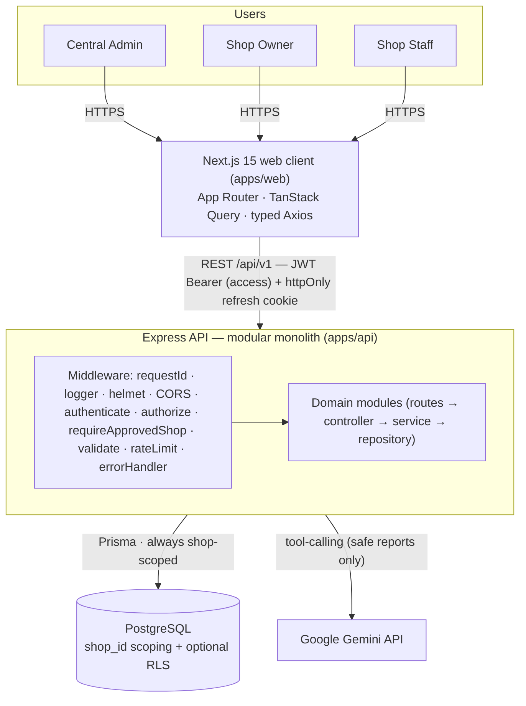
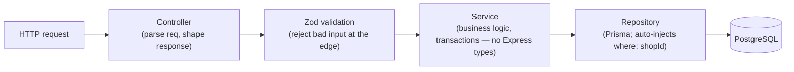
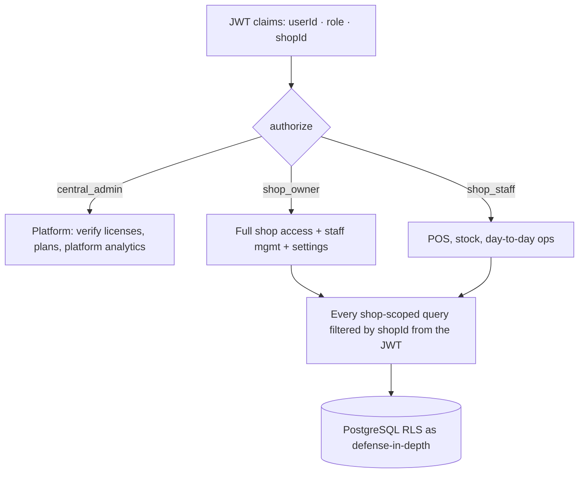
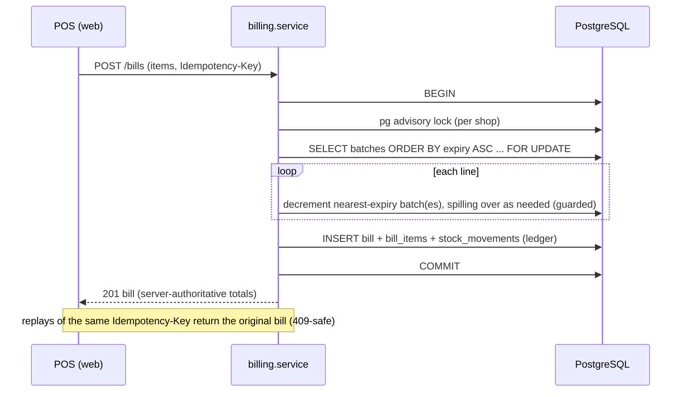
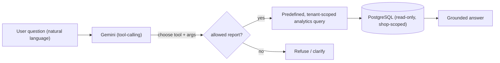
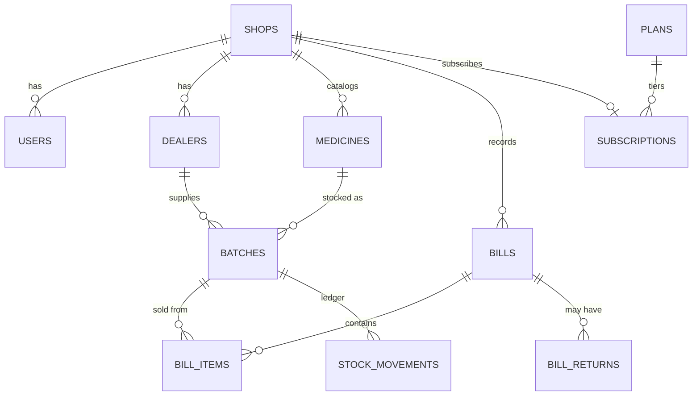
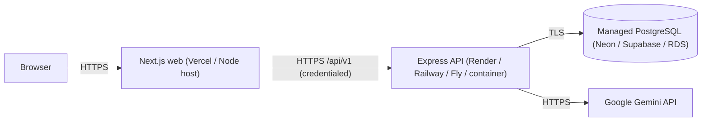

# Stock Easy — Architecture (as-built)

This is the **as-built** architecture with diagrams for technical interviews and portfolio review.
It complements the original design spec in [`/ARCHITECTURE.md`](../ARCHITECTURE.md); where the build
evolved past that spec, the as-built choice is authoritative:

> **Drift from the original spec:** the web client shipped on **Next.js 15 (App Router) + React 19**
> (not Vite), and the AI assistant runs on **Google Gemini `gemini-2.5-flash`** (not Claude). The
> backend, FEFO, tenancy, and money designs match the spec.

---

## 1. System context



---

## 2. Backend layering

One deployable, internally split into domain modules. Strict layering keeps business logic testable.



- Controllers never touch Prisma; services never touch `req`/`res`.
- The base repository auto-injects `where: { shopId }` so no query can forget tenant scope.
- Modules: `auth`, `shops`, `admin`, `dealers`, `medicines`, `batches`, `billing`, `analytics`,
  `ai`, `subscriptions`.

---

## 3. Authentication & token flow

Access token lives **in memory only** (XSS-hardened); the refresh token is an **httpOnly cookie**.
A single-flight interceptor transparently refreshes on 401.

```mermaid
sequenceDiagram
  participant W as Web (Axios + TanStack Query)
  participant A as API /auth
  W->>A: POST /auth/login (email, password)
  A-->>W: 200 { accessToken } + Set-Cookie: refresh (httpOnly)
  Note over W: access token kept in memory (never localStorage)
  W->>A: GET /api/v1/... (Authorization: Bearer access)
  A-->>W: 401 (access expired)
  W->>A: POST /auth/refresh (cookie) — single-flight
  A-->>W: 200 { accessToken } (rotated; reuse → family revoke)
  W->>A: retry original request → 200
```

On a hard reload the in-memory token is gone, so the app bootstraps by calling `/auth/refresh`
with the cookie to restore the session.

---

## 4. RBAC & multi-tenancy



- **Tenant = a `shops` row.** `shop_id` is on every shop-scoped table and comes from the JWT —
  **never** from client input.
- RBAC is enforced by `authenticate` + `authorize(...roles)` middleware; `requireApprovedShop`
  gates shop features behind license verification.
- Row-Level Security (`apps/api/prisma/rls.sql`) can enforce isolation at the DB layer too.

---

## 5. FEFO sale (the core differentiator)

Each sale consumes the **nearest-expiry** batch first, in one transaction, with no oversell under
concurrency.



Returns/voids restore the **exact** batches via the `stock_movements` ledger + `bill_returns`.

---

## 6. AI assistant (safe NL analytics)

The assistant never generates raw SQL. Gemini is given **tools** that map to a fixed set of
read-only analytics reports; it can only choose a tool + parameters.



If `GEMINI_API_KEY` is unset, `/ai` returns 503 (the rest of the app is unaffected).

---

## 7. Data model (core entities)



Supporting tables include `idempotency_keys` (safe POST /bills replays), `bill_return_items`, and
refresh-token records with a `family_id` for reuse detection. Money columns are `Decimal`
(ROUND_HALF_UP @2dp, GST tax-exclusive) and serialized as 2-dp strings.

---

## 8. Frontend architecture

- **App Router route groups:** `(auth)` (login/register) and `(app)` (the authenticated shell —
  `AuthGuard` → `AppShell`; pages additionally wrapped in `RoleGuard`).
- **State:** TanStack Query over a typed Axios layer (`services/api`) that unwraps the
  `{ success, data, meta }` envelope and handles silent token refresh.
- **Composition:** `components/ui` (primitives) + `components/shared` (DataTable, StatCard, EmptyState,
  ErrorState, FormField…) + `features/*`. Charts (Recharts) are code-split via `next/dynamic`.
- **Design system:** token-driven "Slate Pro" — see [`apps/web/DESIGN_SYSTEM.md`](../apps/web/DESIGN_SYSTEM.md).

---

## 9. Deployment topology



Full steps: [`DEPLOYMENT.md`](DEPLOYMENT.md). Operations: [`OPERATIONS.md`](OPERATIONS.md).
