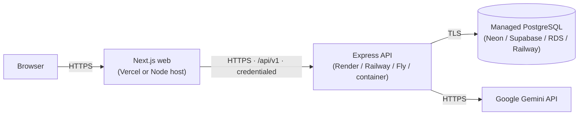

# Deployment Guide

Stock Easy deploys as **three independent pieces**, with no changes to the application structure:

1. **PostgreSQL** — a managed database
2. **API** — the Express/Node service (`apps/api`)
3. **Web** — the Next.js client (`apps/web`)



## Hosting options

| Component | Recommended | Also works |
|---|---|---|
| Web (Next.js 15) | **Vercel** (zero-config) | Any Node host / container: `next build` → `next start` |
| API (Express) | **Render** / **Railway** | Fly.io, a container on ECS/Cloud Run, a VPS + PM2 |
| Database | **Neon** / **Supabase** | Amazon RDS, Railway PG, self-managed PostgreSQL ≥ 14 |

## 1. Database

1. Create a PostgreSQL database; copy its connection string into the API's `DATABASE_URL`.
2. Apply the schema (idempotent): from `apps/api`, `npm run db:migrate` (`prisma migrate deploy`).
3. **(Optional, recommended)** enable Row-Level Security as defense-in-depth: apply
   `apps/api/prisma/rls.sql` and run the API under the non-superuser app role.
4. Seed only if you want demo data (do **not** seed a real production tenant DB): `npm run db:seed`.

## 2. API

Build & run (Node 20):

```bash
cd apps/api
npm ci
npm run prisma:generate
npm run build            # tsc → dist/
npm run db:migrate       # apply migrations to the target DB
npm start                # node dist/server.js   (GET /health → 200)
```

Set env per [`ENVIRONMENT.md`](ENVIRONMENT.md): `DATABASE_URL`, `JWT_ACCESS_SECRET`,
`JWT_REFRESH_SECRET`, `CORS_ORIGIN=<web origin>`, `NODE_ENV=production`, and `GEMINI_API_KEY`.
The app already calls `app.set('trust proxy', 1)` for correct client IPs behind a load balancer.

## 3. Web

```bash
cd apps/web
npm ci
# NEXT_PUBLIC_API_URL is inlined at build time:
NEXT_PUBLIC_API_URL="https://api.yourdomain.com/api/v1" npm run build
npm start                # next start  (or deploy to Vercel)
```

Security headers (CSP, HSTS, X-Frame-Options, COOP/CORP, …) are already emitted by
`next.config.mjs`; the CSP `connect-src` is derived from `NEXT_PUBLIC_API_URL` automatically.

## 4. Cross-site cookies (important)

Auth uses an httpOnly **refresh cookie** that is **hardcoded `SameSite=Strict`** (verified in
`apps/api/src/modules/auth/controller.ts`). Strict cookies are only sent on **same-site** requests, so
**deploy the web and API on the same registrable domain** — e.g. `app.yourdomain.com` +
`api.yourdomain.com` (both under `yourdomain.com`). Then auth works with **no code change**, and
`CORS_ORIGIN` must equal the exact web origin (`https://app.yourdomain.com`). A bare cross-site split
(`*.vercel.app` + `*.onrender.com`) drops the cookie on refresh → users get logged out; that path would
require changing the cookie to `SameSite=None; Secure` (a code change). Full detail: [`../DEPLOY_STOCKEASY.md`](../DEPLOY_STOCKEASY.md) §0.

## 5. Post-deploy smoke test

```bash
curl https://api.yourdomain.com/health          # → {"success":true,"data":{"status":"ok",...}}
```
Then in the browser: load the web origin → sign in → confirm the dashboard renders with data, and
the Network tab shows `/api/v1/*` calls returning 200 (no CORS errors).

## 6. Rollback

- **Web:** redeploy the previous build (Vercel: instant "Promote to Production" of a prior deployment).
- **API:** redeploy the previous image/release.
- **Database:** migrations are additive; prefer roll-**forward** (a new corrective migration). For a true
  rollback, restore from a point-in-time backup (see [`OPERATIONS.md`](OPERATIONS.md)) — never hand-edit
  applied migrations.

## 7. Pre-flight checklist

- [ ] Fresh `JWT_ACCESS_SECRET` / `JWT_REFRESH_SECRET` (not the dev defaults)
- [ ] `CORS_ORIGIN` = deployed web origin(s); `NODE_ENV=production`
- [ ] `DATABASE_URL` points at the managed DB; `prisma migrate deploy` has run
- [ ] `NEXT_PUBLIC_API_URL` set at web build time
- [ ] `GEMINI_API_KEY` provided via the platform secret store (rotated, never committed)
- [ ] HTTPS everywhere; refresh cookie `SameSite=None; Secure`
- [ ] `GET /health` returns 200; sign-in works end-to-end
